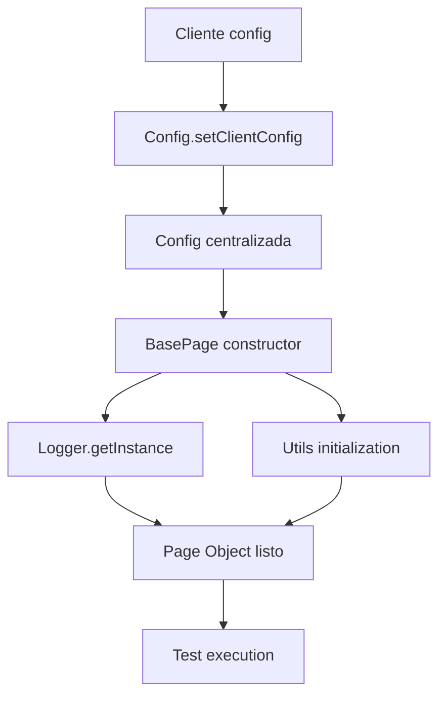
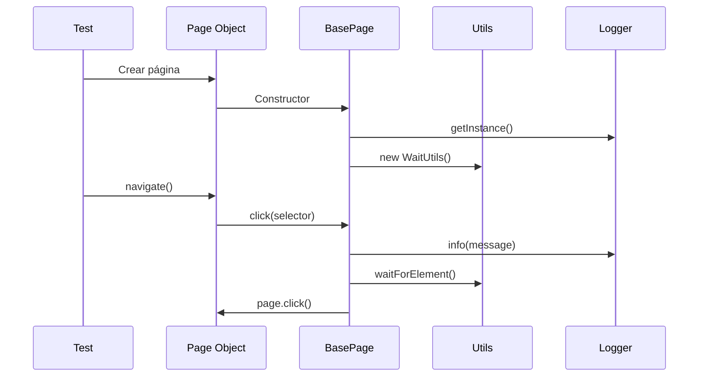

# 🏗️ Arquitectura del Framework - Documentación Técnica

## 📋 Tabla de Contenidos
- [Visión General](#visión-general)
- [Principios de Diseño](#principios-de-diseño)
- [Arquitectura Core](#arquitectura-core)
- [Patrones de Diseño](#patrones-de-diseño)
- [Flujo de Datos](#flujo-de-datos)
- [Extensibilidad](#extensibilidad)
- [Decisiones Arquitectónicas](#decisiones-arquitectónicas)

## 🎯 Visión General

El framework está diseñado como una **arquitectura modular de capas** que separa las responsabilidades y permite la extensión sin modificación del código core.

### Objetivos Arquitectónicos
- ✅ **Reutilización**: Core común para todos los clientes
- ✅ **Escalabilidad**: Fácil adición de nuevos clientes
- ✅ **Mantenibilidad**: Cambios localizados, bajo acoplamiento
- ✅ **Consistencia**: Misma estructura y patrones para todo
- ✅ **Flexibilidad**: Configuración específica por cliente

## 🧭 Principios de Diseño

### 1. SOLID Principles

#### Single Responsibility Principle (SRP)
```typescript
// ✅ Cada clase tiene una responsabilidad
class Logger {           // Solo logging
class Config {           // Solo configuración  
class WaitUtils {        // Solo esperas
```

#### Open/Closed Principle (OCP)
```typescript
// ✅ Extensible sin modificación
abstract class BasePage {    // Cerrado para modificación
  abstract isLoaded();       // Abierto para extensión
}

class LoginPage extends BasePage {  // Extiende sin modificar
  async isLoaded() { /* implementación específica */ }
}
```

#### Liskov Substitution Principle (LSP)
```typescript
// ✅ Cualquier BasePage puede ser sustituida
function testPage(page: BasePage) {
  await page.isLoaded();  // Funciona con cualquier implementación
}
```

#### Interface Segregation Principle (ISP)
```typescript
// ✅ Interfaces específicas y cohesivas
interface ClientConfig {     // Solo configuración de cliente
interface TestData {         // Solo datos de test
interface UserData {         // Solo datos de usuario
```

#### Dependency Inversion Principle (DIP)
```typescript
// ✅ Dependemos de abstracciones
class BasePage {
  constructor(page: Page) {  // Depende de abstracción de Playwright
    this.config = Config.getInstance();  // No de implementación concreta
  }
}
```

### 2. Composition over Inheritance
```typescript
// ✅ BasePage compone utilities en lugar de heredar
class BasePage {
  protected waitUtils: WaitUtils;        // Tiene una utilidad de espera
  protected screenshotUtils: ScreenshotUtils;  // Tiene una utilidad de capturas
  // En lugar de: extends WaitUtils, ScreenshotUtils (herencia múltiple)
}
```

## 🏛️ Arquitectura Core

### Estructura de Capas

```
┌─────────────────────────────────┐
│          CLIENT LAYER           │  ← Implementaciones específicas
├─────────────────────────────────┤
│           CORE LAYER            │  ← Framework base reutilizable
├─────────────────────────────────┤
│        UTILITY LAYER            │  ← Servicios y herramientas
├─────────────────────────────────┤
│      INFRASTRUCTURE LAYER       │  ← Playwright, Node.js, FS
└─────────────────────────────────┘
```

### Módulos Core Detallados

#### 📁 config/ - Sistema de Configuración

```typescript
┌─────────────┐    ┌─────────────┐    ┌─────────────┐
│   Config    │◄──►│ Environment │    │ClientConfig │
│ (Singleton) │    │             │    │(Interface)  │
└─────────────┘    └─────────────┘    └─────────────┘
```

**Responsabilidades:**
- **Config**: Punto central de configuración, patrón Singleton
- **Environment**: Manejo de variables del sistema operativo
- **ClientConfig**: Contrato que define qué debe configurar cada cliente

**¿Por qué Singleton para Config?**
- Garantiza una sola fuente de verdad para configuración
- Acceso global sin pasar parámetros por toda la aplicación
- Inicialización lazy (se crea cuando se necesita)

```typescript
// Ejemplo de uso
const config = Config.getInstance();  // Siempre la misma instancia
const timeout = config.getTimeout();  // Configuración unificada
```

#### 📁 base/ - Clases Base Abstractas

```typescript
┌─────────────┐    ┌─────────────┐    ┌─────────────┐
│  BasePage   │    │  BaseTest   │    │   BaseAPI   │
│ (Abstract)  │    │ (Factory)   │    │ (Abstract)  │
└─────────────┘    └─────────────┘    └─────────────┘
```

**BasePage - Template Method Pattern:**
```typescript
abstract class BasePage {
  // Métodos comunes implementados
  protected async click(selector: string) { /* implementación común */ }
  protected async fill(selector: string, text: string) { /* implementación común */ }
  
  // Método que cada página debe implementar
  abstract isLoaded(): Promise<boolean>;  // Template Method
}
```

**¿Por qué Template Method?**
- Define la estructura común de todas las páginas
- Permite personalización específica sin duplicar código
- Fuerza implementación de métodos críticos

**BaseTest - Factory Pattern:**
```typescript
export const test = base.extend<TestFixtures>({
  config: async ({}, use) => {
    const config = Config.getInstance();  // Factory de Config
    await use(config);
  },
  logger: async ({}, use) => {
    const logger = Logger.getInstance();  // Factory de Logger
    await use(logger);
  }
});
```

**¿Por qué Factory en Tests?**
- Inyección automática de dependencias
- Tests no se preocupan por crear objetos
- Configuración consistente para todos los tests

#### 📁 utils/ - Utilidades Especializadas

```typescript
┌─────────────┐    ┌─────────────┐    ┌─────────────┐
│   Logger    │    │ WaitUtils   │    │ScreenUtils  │
│ (Singleton) │    │             │    │             │
└─────────────┘    └─────────────┘    └─────────────┘
         ▲                ▲                   ▲
         │                │                   │
         └────────────────┼───────────────────┘
                          │
                   ┌─────────────┐
                   │  BasePage   │
                   │             │
                   └─────────────┘
```

**Composición en BasePage:**
```typescript
class BasePage {
  protected logger: Logger;                    // Composición
  protected waitUtils: WaitUtils;              // Composición  
  protected screenshotUtils: ScreenshotUtils;  // Composición
  
  constructor(page: Page) {
    this.logger = Logger.getInstance();        // Inyección
    this.waitUtils = new WaitUtils(page);      // Creación específica
    this.screenshotUtils = new ScreenshotUtils(page);
  }
}
```

**¿Por qué Composición?**
- Flexibilidad: puede cambiar implementaciones
- Testing: fácil mocking de dependencias
- Single Responsibility: cada util hace una cosa
- No hay herencia múltiple (no soportada en TypeScript)

#### 📁 types/ - Sistema de Tipos

```typescript
// Contratos claros y documentación viva
interface ClientConfig {
  name: string;                    // Identificador único
  baseUrl: string;                 // URL base del cliente
  timeout?: number;                // Timeout específico
  credentials?: UserCredentials;   // Credenciales de acceso
  customSelectors?: Selectors;     // Selectores específicos
}
```

**¿Por qué tipos fuertes?**
- **Documentación**: Los tipos son documentación que no miente
- **Refactoring**: Cambios seguros con detección automática de errores
- **Intellisense**: Autocompletado en IDEs
- **Contratos**: Interfaces definen qué debe implementar cada cliente

## 🎨 Patrones de Diseño

### 1. Singleton Pattern

**Aplicado en:** Config, Logger

```typescript
class Config {
  private static instance: Config;
  
  private constructor() { /* inicialización */ }
  
  public static getInstance(): Config {
    if (!Config.instance) {
      Config.instance = new Config();  // Lazy initialization
    }
    return Config.instance;
  }
}
```

**Ventajas:**
- Una sola fuente de verdad
- Acceso global controlado
- Inicialización lazy

**Desventajas consideradas:**
- Puede dificultar testing (solucionado con DI en tests)
- Estado global (controlado con immutabilidad)

### 2. Template Method Pattern

**Aplicado en:** BasePage, BaseAPI

```typescript
abstract class BasePage {
  // Operaciones comunes (template)
  protected async click(selector: string) {
    this.logger.info(`Clicking: ${selector}`);     // Paso común
    await this.waitUtils.waitForElement(selector); // Paso común
    await this.page.click(selector);               // Paso común
  }
  
  // Operación específica que debe implementar cada subclase
  abstract isLoaded(): Promise<boolean>;  // Primitive operation
}
```

**Ventajas:**
- Reutilización de código común
- Estructura consistente
- Extensibilidad controlada

### 3. Factory Pattern

**Aplicado en:** BaseTest fixtures

```typescript
export const test = base.extend<TestFixtures>({
  config: async ({}, use) => {
    const config = Config.getInstance();  // Factory method
    await use(config);
  }
});
```

**Ventajas:**
- Creación centralizada de objetos
- Inyección de dependencias automática
- Configuración consistente

### 4. Strategy Pattern

**Aplicado en:** ClientConfig

```typescript
// Diferentes estrategias de configuración
const clientAConfig: ClientConfig = { /* estrategia A */ };
const clientBConfig: ClientConfig = { /* estrategia B */ };

Config.getInstance().setClientConfig(clientAConfig);  // Cambio de estrategia
```

**Ventajas:**
- Algoritmos intercambiables (configuraciones)
- Extensibilidad sin modificación
- Encapsulación de variaciones

## 🔄 Flujo de Datos

### Inicialización del Framework



### Ejecución de Test



### Configuración por Cliente

```typescript
// 1. Cliente define su configuración
const clientConfig: ClientConfig = {
  name: 'client-a',
  baseUrl: 'https://client-a.com',
  customSelectors: {
    loginButton: '#login-btn'
  }
};

// 2. Framework consume la configuración
Config.getInstance().setClientConfig(clientConfig);

// 3. Page Objects acceden automáticamente
class LoginPage extends BasePage {
  async clickLogin() {
    const selector = this.config.getClientConfig()?.customSelectors?.loginButton;
    await this.click(selector);  // Usa configuración específica
  }
}
```

## 🔧 Extensibilidad

### Agregando Nuevos Clientes

```typescript
// 1. Crear configuración específica
const newClientConfig: ClientConfig = {
  name: 'new-client',
  baseUrl: 'https://new-client.com',
  customSelectors: { /* selectores específicos */ }
};

// 2. Crear Page Objects específicos
class NewClientLoginPage extends BasePage {
  async isLoaded() { /* implementación específica */ }
}

// 3. Usar sin modificar core
```

### Agregando Nuevas Utilidades

```typescript
// 1. Crear nueva utilidad
class DatabaseUtils {
  constructor(private config: DatabaseConfig) {}
  async query(sql: string) { /* implementación */ }
}

// 2. Integrar en BasePage
class BasePage {
  protected dbUtils: DatabaseUtils;
  
  constructor(page: Page) {
    // ... otros utils
    this.dbUtils = new DatabaseUtils(this.config.getDatabaseConfig());
  }
}
```

## 💡 Decisiones Arquitectónicas

### ¿Por qué no un Framework Genérico?

**Opción Descartada:** Framework que funcione para cualquier aplicación web
**Decisión:** Framework específico para consultoría multi-cliente

**Razones:**
- **Consistencia**: Todos los clientes usan mismos patrones
- **Eficiencia**: Funcionalidad específica para nuestras necesidades
- **Mantenimiento**: Un solo equipo mantiene un framework conocido
- **Productividad**: Setup rápido de nuevos clientes

### ¿Por qué TypeScript y no JavaScript?

**Decisión:** TypeScript para todo el framework

**Razones:**
- **Seguridad**: Detección temprana de errores
- **Refactoring**: Cambios seguros y automáticos
- **Documentación**: Tipos como documentación viva
- **Tooling**: Mejor experiencia de desarrollo (autocomplete, etc.)
- **Escalabilidad**: Mejor para equipos grandes

### ¿Por qué Playwright y no Selenium?

**Decisión:** Playwright como base

**Razones:**
- **Velocidad**: Ejecución más rápida
- **Reliability**: Menos flaky tests
- **Features**: Auto-wait, network interception, multiple browsers
- **Developer Experience**: Mejor debugging y reporting
- **Modernidad**: Diseñado para aplicaciones web modernas

### ¿Por qué Abstracciones Base?

**Decisión:** BasePage, BaseTest, BaseAPI abstractas

**Razones:**
- **Consistencia**: Misma estructura para todos los clientes
- **Funcionalidad**: Logging, screenshots, waits automáticos
- **Evolución**: Agregar features sin tocar código de clientes
- **Training**: Desarrolladores aprenden un patrón, funciona en todos lados

## 🎯 Conclusión

Esta arquitectura logra los objetivos iniciales:

- ✅ **Reutilización**: 80% del código es común
- ✅ **Escalabilidad**: Nuevos clientes en minutos
- ✅ **Mantenibilidad**: Cambios localizados y seguros  
- ✅ **Consistencia**: Mismos patrones en todos lados
- ✅ **Flexibilidad**: Configuración específica por cliente

El framework evoluciona de manera controlada, permitiendo agregar funcionalidad sin romper implementaciones existentes, cumpliendo con los principios SOLID y usando patrones de diseño probados.